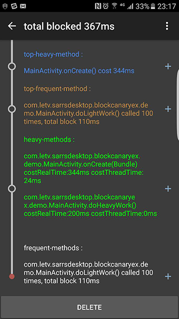

BlockCanaryEx
=============
[English doc](https://github.com/lqcandqq13/BlockCanaryEx/blob/master/README.md)<br/>
记录主线程中执行的所有方法和它们的执行时间，当app卡顿时，将所有耗时方法直接展示给开发者，大量节省开发者定位卡顿问题的时间。
此项目基于 [BlockCanary](https://github.com/markzhai/AndroidPerformanceMonitor).



BlockCanaryEx和BlockCanary的区别如下
-------------
- BlockCanaryEx基于BlockCanary,继承它的ui和大部分功能;
- BlockCanaryEx添加了方法采样,知道所有方法的执行时间和执行次数;
- 当应用卡顿时，BlockCanaryEx更关注app代码中，哪些方法耗时最多，重点记录和显示这些耗时方法.

安装
-------------
root build.gradle
```groovy
buildscript {
    repositories {
        jcenter()
    }
    dependencies {
        classpath 'com.android.tools.build:gradle:1.5.0' //version must >= 1.5.0
        classpath 'com.letv.sarrsdesktop:BlockCanaryExPlugin:0.9.3'
    }
}
```
model build.gradle
```groovy
apply plugin: 'blockcanaryex'
```

```groovy
compile 'com.letv.sarrsdesktop:BlockCanaryExJRT:0.9.3'
```

基础使用
-------------

在应用application onCreate()时，初始化BlockCanaryEx

```java
public class TestApplication extends Application {
    @Override
    public void onCreate() {
        super.onCreate();
        if(BuildConfig.DEBUG) {
            //we don't suggest use BlockCanaryEx on release version
            //TODO add no-op version BlockCanaryEx
            BlockCanaryEx.install(new Config(this));
        }
    }
}
```

done，现在BlockCanaryEx已经在app debug模式中生效。

进阶使用
-------------

BlockCanaryEx在编译期，通过字节码注入，将方法采样器注入到你的代码中。字节码注入的代码范围，默认是你的project源码和subproject源码。project libs和subProject libs，external libs默认是不注入方法采样器的。如果你想扩大你的方法采样，监测更多的方法性能，你可以在build.gradle是修改字节码注入的范围。

```groovy
  apply plugin: 'blockcanaryex'

  block {
      debugEnabled true //enable MethodSampler when debug mode, default true
      releaseEnabled false //enable MethodSampler when release mode, default false
      excludePackages [] //exclude the package you don't want to inject MethodSampler, eg: ['com.android', 'android.support']
      excludeClasses [] //exclude the class you don't want to inject MethodSampler
      includePackages [] //only include the package you want to inject MethodSampler, packages which don't included will not be injected

      scope {
          project true //inject MethodSampler for app project, default true
          projectLocalDep false //inject MethodSampler for app libs(eg: .jar), default false
          subProject true //inject MethodSampler for subProject of app project, default true
          subProjectLocalDep false //inject MethodSampler for subProject libs, default false
          externalLibraries false //inject MethodSampler external libs, default false
      }
  }
 ```

你也可能以通过覆写更多的Config方法，来定制BlockCanaryEx的运行时表现。

```java
  public class TestApplication extends Application {
      @Override
      public void onCreate() {
          super.onCreate();
          BlockCanaryEx.install(new Config(this) {
              /**
               * provide the looper to watch, default is Looper.mainLooper()
               *
               * @return the looper you want to watch
               */
              public Looper provideWatchLooper() {
                  return Looper.getMainLooper();
              }

              /**
               * If need notification to notice block.
               *
               * @return true if need, else if not need.
               */
              public boolean displayNotification() {
                  return true;
              }

              /**
               * judge whether the loop is blocked, you can override this to decide
               * whether it is blocked by your logic
               *
               * Note: running in none ui thread
               *
               * @param startTime in mills
               * @param endTime in mills
               * @param startThreadTime in mills
               * @param endThreadTime in mills
               * @return true if blocked, else false
               */
              public boolean isBlock(long startTime, long endTime, long startThreadTime, long endThreadTime) {
                  long costRealTime = endTime - startTime;
                  return costRealTime > 100L && costRealTime < 2 * (endThreadTime - startThreadTime);
              }

              /**
               * judge whether the method is heavy method, we will print heavy method in log
               *
               * Note: running in none ui thread
               *
               * @param methodInfo {@link com.letv.sarrsdesktop.blockcanaryex.jrt.MethodInfo}
               * @return true if it is heavy method, else false
               */
              public boolean isHeavyMethod(com.letv.sarrsdesktop.blockcanaryex.jrt.MethodInfo methodInfo) {
                  return methodInfo.getCostThreadTime() >= 1L;
              }

              /**
               * judge whether the method is called frequently, we will print frequent method in log
               *
               * Note: running in none ui thread
               *
               * @param frequentMethodInfo the execute info of same method in this loop {@link FrequentMethodInfo}
               * @return true if it is frequent method, else false
               */
              public boolean isFrequentMethod(FrequentMethodInfo frequentMethodInfo) {
                  return frequentMethodInfo.getTotalCostRealTimeMs() > 1L && frequentMethodInfo.getCalledTimes() > 1;
              }

              /**
               * Path to save log, like "/blockcanary/", will save to sdcard if can, else we will save to
               * "${context.getFilesDir()/${provideLogPath()}"}"
               *
               * Note: running in none ui thread
               *
               * @return path of log files
               */
              public String provideLogPath() {
                  return "/blockcanaryex/" + getContext().getPackageName() + "/";
              }

              /**
               * Network type to record in log, you should impl this if you want to record this
               *
               * @return {@link String} like 2G, 3G, 4G, wifi, etc.
               */
              public String provideNetworkType() {
                  return "unknown";
              }

              /**
               * unique id to record in log, you should impl this if you want to record this
               *
               * @return {@link String} like imei, account id...
               */
              public String provideUid() {
                  return "unknown";
              }

              /**
               * Implement in your project.
               *
               * @return Qualifier which can specify this installation, like version + flavor.
               */
              @TargetApi(Build.VERSION_CODES.DONUT)
              public String provideQualifier() {
                  PackageInfo packageInfo = ProcessUtils.getPackageInfo(getContext());
                  ApplicationInfo applicationInfo = getContext().getApplicationInfo();
                  if(packageInfo != null) {
                      return applicationInfo.name + "-" + packageInfo.versionName;
                  }
                  return "unknown";
              }

              /**
               * Block listener, developer may provide their own actions
               *
               * @param blockInfo {@link BlockInfo}
               */
              @Override
              public void onBlock(BlockInfo blockInfo) {
              }
          });
      }
  }
 ```

License
-------

     Licensed under the Apache License, Version 2.0 (the "License");
     you may not use this file except in compliance with the License.
     You may obtain a copy of the License at

        http://www.apache.org/licenses/LICENSE-2.0

     Unless required by applicable law or agreed to in writing, software
     distributed under the License is distributed on an "AS IS" BASIS,
     WITHOUT WARRANTIES OR CONDITIONS OF ANY KIND, either express or implied.
     See the License for the specific language governing permissions and
     limitations under the License.
